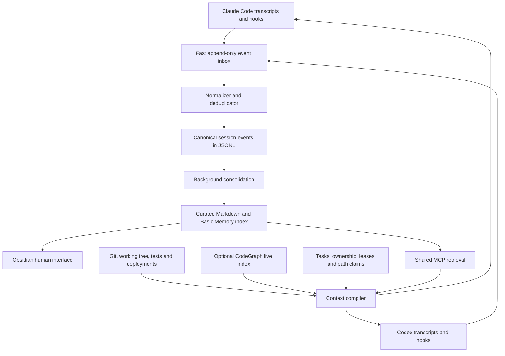
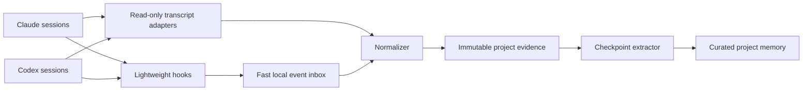
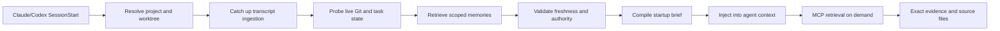
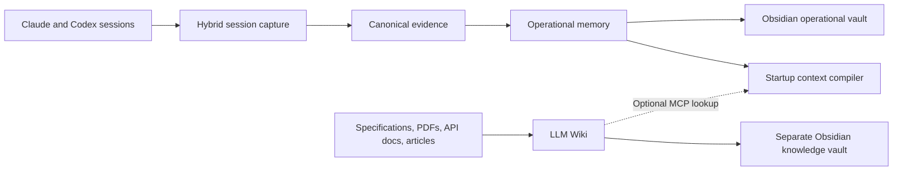
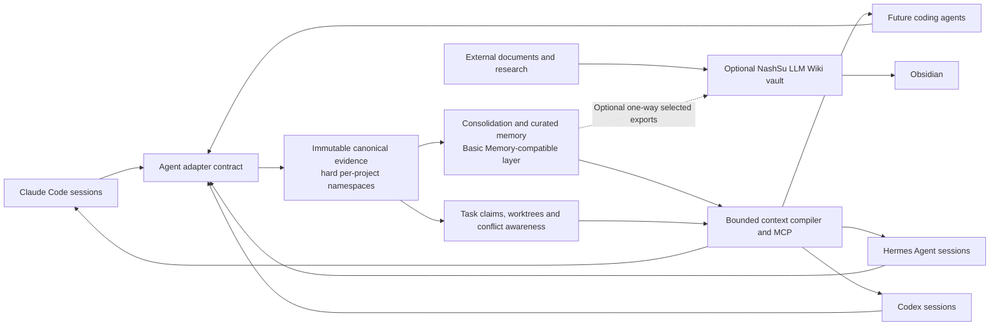

# Conversation Export

- Task: Build cross-agent knowledge base
- Thread ID: `019fb8e5-539f-7563-8eff-36da6167d7ba`
- Exported: 2026-08-01
- Scope: All user-visible user and assistant messages available in the task at export time. Internal reasoning, system/developer instructions, and tool outputs are excluded.

---

## 1. User

*Turn started: 2026-07-31T15:57:57.000Z*


# Files mentioned by the user:

## research-discipline.md: C:/Users/quekm/Desktop/projects/(Harness) Tools Used/research-discipline.md

## My request for Codex:
Task: so now i want build a secondary brain/knowledge base  for my ai agents that can used across different coding agents (claude code, codex)

Based on my knowledge, this secondary brain is a long term and well-persisted memory management from every session and eventually become my coding agent's context on every single session (no matter new or old session, or even a megathread/megasession)  

So based on my surface research , most well-known , highly adapted, famous stack can be LLM Wiki (https://github.com/nashsu/llm_wiki), Obsidian (https://obsidian.md/ + https://github.com/obsidianmd) , codegraph(https://github.com/colbymchenry/codegraph)  

Pain point i faced and i wanted to solve from my current workflow, work quality and token usage (purpose of this task): 

my workflow : I start to develop project A with 2-4 claude code session(under that project directory) at the same time or if needed i would develop project B also with another 2-4 claude code session(under that project directory) , and every session i will compact when context windows hit , thus it would be megathread/megasession for those session , and i also develop either project A or project B at codex with codex session

(In Claude Code) , no matter project A or B

1) those 2-4 mega session in project dont know the works done by other session other than its own session (No memory and context of each other session ), so if two of the session agent make changes on the files and even same line of code, it might lead to code changes conflict (multiple people edited the same line of code in different ways, or one person edited a file that another person deleted)

2) when i open a new/isolated fifth session in claude code to work on that project , 

2.1)  i want to continue one of the previous session same task, i need to export the previous session that i think it is needed for this new session and upload the exported session memory for this new session to read and know what i did(which after the session read all the exported session context , it already consumed alost of my subscription plan usage which is a very bad method, approach to read the other session memory as current session context)

#Reason of this action: i want to continue one of the previous session task with full context and start in a new session to continue work on that task(When i feels like one of the mega session starting become stupid, conflict,and confusing) 

2.2) and in order to makesure this new session know the latest code, system progress and full pictures of most latest pushed/deployed system to move on to new features dev task, i  have to prompt the agent to read the codebase to go through the latest system updates and even manually prompt the information that is not uncessary if the coding agents follows and remember the memory and context  of every fixes,update and changes for that project(which after the session read the all files in entire codebase , it already consumed alost of my subscription plan usage which is a very bad method, approach to have the latest project details and project code implementation)

#Reason of this action:  letting agent to read the claude.md / readme.txt to understand latest project details is a terrible experiences which most of the time the details inside them are out-dated and wrong version before corrected and lead to misunderstandings)

(Codex) 

3)when i open a new session in codex to work on that same project, i need to do steps 2.1) and step 2.2) to makesure the new codex session able to read the previous exported session context and read memory that i think it is needed for new session and understand the latest code, system progress and full pictures of most latest pushed/deployed system

(both claude code and codex) 

4) both of the coding agents dont know what are the memory ,context of works done on another coding agents platform which they dont have shared memory space/layer and not accessible to the memory data of each other  , because codex and claude code store new session under their own database folder , but no sync up and shared data between both of them

(I know claude code have agent/memory folder to manage all the memory on claude code, but it is not reachable to codex when due to another coding agents workings at his own environment  and save the memory to different project folder) 

5) And both claude code and codex if i ask them what i did last fews day /past week, they only can remember partial pieces without full clear pictures and i dont know the past memory they remember is correct one or out-dated one  

Successful /Goal / Expected Result: Having a secondary brain or knowledge base can be plugged for all of my using coding agents (codex, claude code ), and both codex and claude code can share the agent memory together (in their new session, new task context for works) , know and remember what i did on both coding agent's session, and the agent memory stacked since the time i started to built the agent secondary brain ( remember what i did yesterday,last week, last month since the day this knowledge base built), and the memory retrieved and grabbed by the coding agents from this knowledge base need to be precise, informative, useful that can be work alongside with the coding agent's to achieve the highest agent working quality with most completed agent memory management

Do online research on real user and top discussion with  [$agent-reach](C:\\Users\\quekm\\.agents\\skills\\agent-reach\\SKILL.md) +research-discipline.md needed, Discuss with me your findings, and your review of current task , dont do any code implementation until the final plan that can solve my pain point, reach my goal and brings out expected result as a successful works

---

## 2. Assistant — Commentary

*Turn started: 2026-07-31T15:57:57.000Z*

I’ll treat this as an architecture and workflow investigation, with zero implementation for now. I’m using the named `agent-reach` skill to gather real-world discussions, and I’ll apply your `research-discipline.md` as the evidence and synthesis standard before proposing a plan.

---

## 3. Assistant — Commentary

*Turn started: 2026-07-31T15:57:57.000Z*

I’ve finished the governing instructions. The research standard is strict: repository claims must include stars, real `pushedAt`, creation date, and archive/fork status; evidence will be labeled ✅ verified, 📄 sourced, or ❓ uncertain. I’ll now use agent-reach’s GitHub, web/Exa, and real-user discussion routes rather than silently substituting generic search.

---

## 4. Assistant — Commentary

*Turn started: 2026-07-31T15:57:57.000Z*

The workspace is empty—not an existing codebase—so there is no legacy implementation to preserve. I’m treating this as a greenfield system-design task. Agent-reach reports working backends for Exa, GitHub, Reddit, X, V2EX, Bilibili, and Xiaohongshu; I’ll use those sources and separate vendor claims from user evidence.

---

## 5. Assistant — Commentary

*Turn started: 2026-07-31T15:57:57.000Z*

One agent-reach route hit a Windows execution-policy issue: PowerShell selected `mcporter.ps1` and blocked it. I’m not downgrading to generic web search; I’ll retry the same Exa backend through its Windows `.cmd` launcher. The other source routes remain available.

---

## 6. Assistant — Commentary

*Turn started: 2026-07-31T15:57:57.000Z*

An early conclusion is already forming: your three named tools solve different layers, not the same problem. LLM Wiki is a synthesized knowledge interface; Obsidian is an editable/auditable file UI; CodeGraph is live code intelligence. None alone is a session-memory and multi-writer coordination system. I’m now validating the two strongest cross-agent memory candidates—Basic Memory and Claude-Mem—especially their Claude/Codex capture parity, compaction hooks, and source-of-truth model.

---

## 7. Assistant — Commentary

*Turn started: 2026-07-31T15:57:57.000Z*

Using agent-reach’s Reddit/OpenCLI and X/OpenCLI routes now for first-hand reports, plus Bilibili/Xiaohongshu for Chinese-language workflows. I’ll prioritize discussions with concrete failure modes—lost context, stale memory, compaction, parallel-session collisions, and retrieval cost—over popularity alone.

---

## 8. Assistant — Commentary

*Turn started: 2026-07-31T15:57:57.000Z*

The community route hit the same Windows launcher quirk (`opencli.ps1` blocked), not an authentication or platform failure. I’m retrying the required OpenCLI backend through `opencli.cmd`; no source substitution is being made.

---

## 9. Assistant — Commentary

*Turn started: 2026-07-31T15:57:57.000Z*

The strongest practical trade-off is now visible: Basic Memory is transparent and cross-agent, but its durable writes are checkpoint/decision driven; the planned “watch every Claude/Codex transcript and build the graph” sidecar is still an open feature. Claude-Mem captures automatically on every tool/turn, but its latest stable release has a dense set of open Windows lifecycle, port, latency, and data-integrity reports. I’m checking native Claude/Codex memory next so the final design does not duplicate what the harnesses already do well.

---

## 10. Assistant — Commentary

*Turn started: 2026-07-31T15:57:57.000Z*

The research also confirms a crucial boundary: shared memory does not prevent simultaneous edits. To solve your first pain point, the design needs a separate coordination plane—task ownership, file/area reservations, and isolated worktrees. I’m evaluating mature coordination tools now so the plan does not ask the memory layer to do a job it cannot safely perform.

---

## 11. Assistant — Commentary

*Turn started: 2026-07-31T15:57:57.000Z*

I’ve finished the main evidence pass. I’m doing the last integrity checks now: verifying update status and tightening the distinction between durable memory, live-code truth, and multi-session coordination—because those are three separate problems, and no single product I found solves all three well.

---

## 12. Assistant

*Turn started: 2026-07-31T15:57:57.000Z*

The core finding is: you should not choose one “secondary brain” product and expect it to solve everything.

Your pain points are actually three separate systems:

1. Durable cross-agent memory: what happened, why, decisions, failures, next steps.
2. Current-code understanding: what the repository really contains now.
3. Multi-agent coordination: who owns which task/files and how conflicting edits are prevented.

LLM Wiki, Obsidian, CodeGraph, Basic Memory, and Claude-Mem each cover only part of that picture.

No implementation or workspace changes were made.

## Research verdict

Legend:

- ✅ Directly verified from repositories, documentation, source, issues, or commands.
- 📄 A vendor/user claim that has not been independently reproduced.
- ❓ Incomplete due to access limitations.

### Candidate assessment

| Candidate | What it does well | What it does not solve | Recommendation |
|---|---|---|---|
| [Basic Memory](https://github.com/basicmachines-co/basic-memory) | Shared Markdown knowledge, SQLite index, graph relationships, MCP access, Claude/Codex integrations, checkpoints | Complete automatic capture of every Claude/Codex session is not finished; its transcript sidecar is still [open issue #669](https://github.com/basicmachines-co/basic-memory/issues/669) | Adopt as the initial curated memory layer |
| [Obsidian](https://obsidian.md/) | Excellent human inspection/editing over plain Markdown; agents can edit the same vault without an Obsidian-specific API | No automatic capture, temporal truth, retrieval policy, coordination, or conflict prevention | Adopt as the human-facing interface, not the memory engine |
| [CodeGraph](https://github.com/colbymchenry/codegraph) | Current symbol, call, dependency, and repository navigation; local SQLite and MCP | Does not remember decisions, sessions, failures, deployment history, or task ownership | Benchmark later as the live-code accelerator |
| [LLM Wiki](https://github.com/nashsu/llm_wiki) | Turns source material into a structured, searchable, Obsidian-compatible wiki; supports MCP and traceability | Does not automatically reconcile native Claude/Codex histories or coordinate concurrent writers | Optional derived-document layer, not the core brain |
| [Claude-Mem](https://github.com/thedotmack/claude-mem) | Most automatic capture: prompt/tool/stop hooks, hybrid retrieval, compressed observations, developing Codex integration | Significant open Windows lifecycle, port, latency, stale-worker, and data-integrity complaints | Sandbox trial only on your Windows environment |
| [Graphiti](https://github.com/getzep/graphiti) | Strong temporal model: facts can be superseded without deleting their history; provenance and validity intervals | Requires graph database, LLM extraction, embeddings, and much more operational complexity | Defer until simpler retrieval fails measured tests |
| [Beads](https://github.com/gastownhall/beads) | Dependency-aware task graph, atomic task claiming, durable agent work state | Adds another database/server and does not replace knowledge retrieval | Promising coordination component after the memory foundation |
| [MCP Agent Mail](https://github.com/Dicklesworthstone/mcp_agent_mail) | Agent identities, inboxes, conversation threads, and file reservations | Its [license explicitly restricts OpenAI and Anthropic](https://github.com/Dicklesworthstone/mcp_agent_mail/blob/main/LICENSE), making it a poor fit for a Claude/Codex system | Do not adopt under its current license |

### The three tools you originally identified

✅ LLM Wiki is closer to a knowledge compiler than agent memory. It is very good for ingesting documentation, research, architecture notes, and other relatively stable sources. Its immutable-source → generated-wiki design is attractive, but it does not provide authoritative session capture or concurrency control.

✅ Obsidian vaults are simply folders of Markdown files, which is exactly why they are useful here. Both Claude and Codex can access those files directly. Obsidian should be the visual editor and audit interface—not the source-capture mechanism.

✅ CodeGraph directly addresses your “new agent must reread the entire codebase” problem. It can navigate repository structure without opening everything. However, its published token savings are 📄 vendor benchmarks, and open issues report resource use, latency on small tasks, and worktree-index-sharing gaps. It needs to earn its place through an A/B benchmark on your projects.

## What real users report

Several recurring themes appeared across Reddit, developer articles, and video-community searches.

✅ A highly discussed parallel-agent thread reported agents overwriting or reverting one another when operating in the same working directory. The most consistent recommendation was one Git worktree per task/agent, plus task-specific instructions. Review and merge workload then becomes the bottleneck. [Discussion](https://www.reddit.com/r/ClaudeAI/comments/1qzduim/stop_running_multiple_claude_code_agents_in_the/)

✅ Obsidian users generally treat the vault as transparent Markdown and give the agent a small index plus a handful of relevant files—not the whole vault. Several explicitly preferred `ripgrep` or FTS before introducing embeddings. [Discussion](https://www.reddit.com/r/ClaudeAI/comments/1rv5ox0/)

✅ One particularly relevant practitioner normalized 4,475 sessions from Claude, Codex, and another assistant into a common JSONL format. Their strongest conclusion was that the normalized raw session history should be permanent and the memory engine should remain replaceable. Their simple SQLite/FTS baseline reportedly outperformed a more elaborate memory engine on their own small test set. This is useful real-user evidence, but not an independent scientific benchmark. [Article](https://builtwithjon.com/articles/memory-systems-history/) and [discussion](https://www.reddit.com/r/ClaudeAI/comments/1u7l40v/)

📄 Another audit of 926 sessions argued that startup payload, repeated reads, tool definitions, and long megasessions create substantial context waste; it favored a fresh session with a curated handoff over endlessly extending one session. The author sells a related tool, so I treat the conclusions as useful but commercially interested. [Discussion](https://www.reddit.com/r/ClaudeAI/comments/1sd8t5u/)

✅ The independent research direction agrees with this design. [LongMemEval](https://arxiv.org/abs/2410.10813) evaluates five things your brain must handle: extraction, multi-session reasoning, temporal reasoning, knowledge updates, and abstention. It shows that merely giving an agent a very long context does not reliably solve long-term memory.

❓ GitHub, official documentation, web/Exa, Reddit, and Bilibili searches worked through `agent-reach`. X and Xiaohongshu could not be inspected because the local browser profiles were not authenticated. I did not silently replace them with another source. `agent-reach` itself is current at v1.5.0.

## Recommended architecture

The durable foundation should be the evidence pipeline, not the wiki or vector database.



### 1. Evidence plane

Every native Claude and Codex session should be transformed into one common, append-only event format.

Each event should retain:

- Project identity
- Native agent and session ID
- Timestamp and timezone
- Working directory and worktree
- Branch and commit SHA
- Prompt, response, command, tool, file-change, test, and deployment events
- Pointer or hash back to the original transcript
- Secret-redaction status

Raw histories remain immutable. If you later replace Basic Memory, Obsidian, embeddings, or Graphiti, you do not lose your history.

Real-time hooks should only enqueue small events and return immediately. Heavy summarization should happen in the background so a broken memory service never blocks Claude or Codex.

### 2. Curated memory plane

Use Basic Memory plus Markdown as the initial shared semantic layer, with Obsidian over the same files.

The memory objects should be typed:

- Immutable session checkpoints
- Decisions with `accepted`, `rejected`, or `superseded` status
- Current tasks and next actions
- Investigations and failed approaches
- Verified project facts
- Procedures and playbooks
- User preferences
- Deployment records

Every derived memory should include evidence links, timestamps, project ID, session ID, branch/SHA, and `last_verified_at`.

Old decisions must not be silently rewritten. A corrected decision should point to the old one through `supersedes`, preserving what was believed at each point in time.

Global preferences should live separately from project memories. Hard project filters should prevent project A facts from leaking into project B.

### 3. Live-code truth plane

Memory must never be treated as authoritative for current code.

For questions such as “How does authentication work now?”, the authority is:

1. Current working tree and Git
2. Tests and deployment state
3. Optional current CodeGraph index
4. Memory and historical explanations

A checkpoint records its commit SHA. When a new session starts, the system compares that SHA with the current repository and provides the changes since the checkpoint. This avoids both full-repository rereads and stale-memory mistakes.

CodeGraph should initially be a controlled experiment. Keep it only if it measurably improves quality or reduces tokens on your actual repositories.

### 4. Coordination plane

Memory alone cannot prevent two sessions from changing the same lines.

The minimum safe concurrency model is:

- One active writer per worktree
- One worktree and branch per independent task
- Every task has an owner and renewable lease
- Optional path-glob claims such as `src/auth/**`
- Startup warning when task or path claims overlap
- Merge-conflict and test preflight before integration
- Expired claims recover automatically after crashes

Beads is a plausible task/claim backend, but I would introduce it only after the basic worktree discipline is operating. A smaller claim ledger may be enough initially.

### 5. Context compiler

A new Claude or Codex session should receive a compiled orientation—not the whole memory store.

Initial target:

- At most roughly 1,000–1,500 tokens
- Current task and owner
- Branch/worktree and current SHA
- Drift since the last checkpoint
- Relevant accepted decisions
- Latest checkpoint and next actions
- Active overlapping claims
- Links or IDs for deeper retrieval

Retrieval then expands progressively:

`short index → relevant timeline → selected note → exact evidence`

For “What did I do last week?”, the answer should be a dated timeline with session, commit, test, and decision evidence. If evidence is missing, the system should explicitly abstain instead of inventing continuity.

## How this addresses your pain points

| Pain point | Required mechanism |
|---|---|
| Concurrent sessions collide | Worktrees, ownership leases, path claims, merge preflight |
| New session needs the previous task | Immutable checkpoint plus current task and evidence-linked handoff |
| New session rereads the whole repository | Git delta since checkpoint plus targeted CodeGraph/current-code queries |
| Claude and Codex cannot share memories | Canonical normalized history plus shared Markdown/MCP layer |
| “What did I do last week?” is incomplete or outdated | Append-only temporal events, superseded facts, time-window retrieval, citations |
| Compaction loses critical context | Pre-compaction checkpoint plus background transcript recovery |
| A session crashes without clean shutdown | Periodic transcript scanning and idempotent ingestion |
| Memory becomes stale | SHA comparison, `last_verified_at`, status and supersession fields |

## Proposed phased plan

This remains a draft until we settle the three decisions below.

1. Define the data contract and authority rules. Establish project IDs, event schemas, evidence links, decision supersession, privacy rules, and evaluation questions.

2. Build read-only transcript discovery and normalization. Import Claude and Codex histories into common append-only JSONL. Do not inject anything into sessions yet.

3. Add Basic Memory and Obsidian. Create typed templates and manual/pre-compaction checkpoints, accessible by MCP from both agents.

4. Add the context compiler. Generate small, citation-backed session orientations and query-specific retrieval with strict token budgets.

5. Add concurrency controls. Introduce mandatory worktrees, task claims, leases, overlap detection, and merge preflight.

6. Benchmark CodeGraph. Compare it against Git plus targeted search on representative new-session tasks.

7. Consider LLM Wiki and Graphiti only after measurements. LLM Wiki would ingest durable documentation into a separate derived area. Graphiti would be considered only if temporal updates and contradictions remain unreliable.

8. Harden the system. Cover secret redaction, backups, schema migrations, corrupt transcripts, concurrent writes, crashes, renamed projects, worktrees, prompt injection inside stored sessions, and audit logging.

The validation suite must include cross-agent continuation, last-day/week/month recall, corrected decisions, false-premise abstention, stale-code detection, conflict warnings, crash recovery, startup-token cost, and citation accuracy.

## Repository health snapshot

Checked 31 July 2026. “Active/original” means not archived and not a fork.

| Repository | Stars | Created | Latest `pushedAt` | Status/license |
|---|---:|---:|---:|---|
| [LLM Wiki](https://github.com/nashsu/llm_wiki) | 15,680 | 2026-04-08 | 2026-07-27 | Active/original, GPL-3 |
| [CodeGraph](https://github.com/colbymchenry/codegraph) | 63,823 | 2026-01-18 | 2026-07-24 | Active/original, MIT |
| [Obsidian Releases](https://github.com/obsidianmd/obsidian-releases) | 20,315 | 2020-05-08 | 2026-07-31 | Active/original; release/community repo, not the application source |
| [Basic Memory](https://github.com/basicmachines-co/basic-memory) | 3,540 | 2024-12-02 | 2026-07-30 | Active/original, AGPL-3 |
| [Claude-Mem](https://github.com/thedotmack/claude-mem) | 89,145 | 2025-08-31 | 2026-07-29 | Active/original, Apache-2 |
| [Graphiti](https://github.com/getzep/graphiti) | 29,403 | 2024-08-08 | 2026-07-30 | Active/original, Apache-2 |
| [Beads](https://github.com/gastownhall/beads) | 25,777 | 2025-10-12 | 2026-07-31 | Active/original, MIT |
| [MCP Agent Mail](https://github.com/Dicklesworthstone/mcp_agent_mail) | 2,061 | 2025-10-23 | 2026-07-20 | Active/original, custom restrictive rider |

## Decisions needed before the final plan

1. Are all Claude Code and Codex sessions stored locally on this Windows machine, or must the brain also ingest remote/cloud sessions and other computers?

2. Are you willing to make “one worktree per concurrent task” mandatory? I consider that essential; memory by itself will not solve edit conflicts.

3. May background consolidation use paid/cloud LLM and embedding APIs, or should phase one remain completely local and privacy-preserving?

My current recommendation is local-first, hybrid capture: automatically preserve all raw evidence, but only promote high-value information into curated long-term memory.

---

## 13. User

*Turn started: 2026-07-31T16:31:41.000Z*

1) all Claude Code and Codex sessions stored locally on this Windows machine
2) yes i will take ur recommendations to makesure to achieve the best and safest results and goals 
3)local and privacy-preserving is not important for this case as i dont have any sensitive data on my local machine ,codex session and claude session that cannot be read and fetched , why paid/cloud LLM and embedding APIs is needed ? what is the reason? but i do glm coding plan api key to call the LLM

remember do any code implementation, i want to focus on the architecture planning first  
So is the LLM wiki able to work inside the obsidian ? and to solve all my pain point , is that i need to implement LLM wiki with obsidian + codegraph?

---

## 14. Assistant — Commentary

*Turn started: 2026-07-31T16:31:41.000Z*

I’ll keep this strictly at architecture level—no code or file changes. I’m using the research skill again to verify the current LLM Wiki ↔ Obsidian relationship, and the brainstorming skill to turn your three answers into a coherent final architecture rather than treating the three products as a bundle by default.

---

## 15. Assistant — Commentary

*Turn started: 2026-07-31T16:31:41.000Z*

For this verification I’m using agent-reach’s GitHub route through `gh` and its web route through the repository’s own documentation. I’m checking whether “Obsidian-compatible” means an embedded Obsidian plugin, a shared vault, or merely exportable Markdown—those are materially different architectures.

---

## 16. Assistant — Commentary

*Turn started: 2026-07-31T16:31:41.000Z*

The Exa launcher rejected the skill’s documented shorthand before running the search. I’m staying on the same agent-reach backend and retrying with its explicit named-argument form; this is a launcher syntax issue, not a fallback to a different research source.

---

## 17. Assistant

*Turn started: 2026-07-31T16:31:41.000Z*

Short answer: ✅ LLM Wiki can work with Obsidian, but LLM Wiki + Obsidian + CodeGraph alone will not solve all five pain points.

No code or files were changed.

## LLM Wiki and Obsidian

✅ LLM Wiki does not run as an Obsidian plugin. Instead, its generated wiki directory is directly usable as an Obsidian vault:

- Markdown files with YAML frontmatter
- `[[wikilinks]]`
- An automatically created `.obsidian/` directory
- Graph-compatible links
- Changes visible from Obsidian because both applications access the same files

The intended workflow is approximately:

```text
LLM Wiki generates and maintains Markdown
                ↓
Obsidian displays, searches and lets you inspect it
                ↓
Claude/Codex query it through LLM Wiki MCP
```

The repository explicitly describes using LLM Wiki and Obsidian side-by-side. [LLM Wiki repository](https://github.com/nashsu/llm_wiki)

One important architectural rule: generated wiki files should have one primary writer. I would let LLM Wiki own generated pages and give human-written notes a protected folder. Editing the same generated page simultaneously through Obsidian and LLM Wiki could otherwise create stale or overwritten information.

Repository health checked 1 August 2026: 15,681 stars, created 2026-04-08, last pushed 2026-07-27, not archived, not a fork.

## Why those three products are insufficient

They cover only these layers:

| Product | Role |
|---|---|
| LLM Wiki | Converts supplied sources into structured knowledge |
| Obsidian | Human interface over the Markdown knowledge |
| CodeGraph | Navigates the current code structure |

They are still missing:

1. A Claude/Codex transcript collector.
2. A common normalized session format.
3. Reliable pre-compaction and task-handoff checkpoints.
4. Current task ownership and agent leases.
5. File/path claims and collision warnings.
6. Worktree enforcement.
7. A startup context compiler with a strict token budget.
8. Temporal rules for accepted versus superseded decisions.
9. Evidence links back to sessions, commits, tests, and deployments.
10. Recovery when a session crashes without cleanly ending.

Therefore, the complete conceptual stack would be:

```text
Claude/Codex session capture
          ↓
Normalized append-only event history
          ↓
LLM Wiki knowledge generation
          ↓
Obsidian inspection + MCP retrieval
          ↓
Small context compiler for every new session

Git + worktrees + task claims         Git + optional CodeGraph
           ↓                                   ↓
    conflict prevention                 current-code truth
```

So LLM Wiki could become the knowledge-generation component, but it cannot be the entire secondary brain.

## LLM Wiki versus Basic Memory

I would not make LLM Wiki and Basic Memory equal writers over the same files. That creates unclear ownership and duplicate consolidation.

There are two possible directions:

- LLM Wiki-centric: better automatic synthesis, source ingestion, Obsidian integration, and knowledge exploration.
- Basic Memory-centric: better explicit checkpoints, decisions, tasks, and agent-oriented memory objects.

Your use case is more operational than a normal personal wiki: sessions, tasks, commits, failures, worktrees, decisions, and handoffs. That makes Basic Memory’s data model naturally attractive. However, LLM Wiki can still be used if we feed it carefully normalized session records and impose a strict project-memory schema.

I have not made that final selection yet. It should be part of the next architecture comparison.

Current health:

- ✅ [Basic Memory](https://github.com/basicmachines-co/basic-memory): 3,540 stars, created 2024-12-02, last pushed 2026-07-30, active/original, AGPL-3.
- ✅ [CodeGraph](https://github.com/colbymchenry/codegraph): 63,825 stars, created 2026-01-18, last pushed 2026-07-24, active/original, MIT.

## Why an LLM API might be needed

An LLM API is not needed for:

- Saving transcripts
- Recording commands and file changes
- Git tracking
- Task ownership
- Worktree coordination
- Exact keyword search
- Reading existing memories

It becomes useful for transforming large raw histories into useful memory:

- Extracting decisions and reasoning
- Producing concise task checkpoints
- Separating outcomes from failed attempts
- Detecting that a newer decision supersedes an older one
- Classifying memories by project and topic
- Deduplicating repeated information
- Generating a small startup brief from many historical records
- Answering broader questions such as “What changed in authentication last month?”

LLM Wiki itself fundamentally uses an LLM for this knowledge-compilation work.

### Embeddings

Embeddings are only needed for semantic retrieval—for example:

- Stored memory says “credential renewal”
- New query asks about “refreshing expired authentication”
- The wording differs, but the meaning is related

They are not mandatory for phase one. I recommend beginning with:

1. Project/time/type filters
2. SQLite FTS or BM25 keyword search
3. Git and session metadata
4. Evidence-linked summaries

Then add embeddings only if our evaluation proves keyword and structured retrieval miss important memories. This reduces complexity and avoids generating vectors for thousands of low-value tool events.

## Using your GLM Coding Plan key

✅ LLM Wiki currently supports custom providers using OpenAI Chat Completions or Anthropic Messages protocols. The GLM Coding Plan provides both protocols through its coding endpoints. [Official GLM tool-integration documentation](https://docs.z.ai/devpack/tool/others)

Therefore, it is technically plausible to configure GLM as LLM Wiki’s model provider.

However, there is a policy caveat: the official GLM documentation says Coding Plan subscription benefits are limited to supported tools and scenarios. I did not find LLM Wiki explicitly named as supported. We should not assume that a custom background consolidation service is covered by your Coding Plan quota.

The safe architecture is:

- Design the model provider as replaceable.
- Initially test GLM through the compatible endpoint.
- Verify whether LLM Wiki/background processing is permitted under your subscription.
- If not, use GLM’s normal pay-as-you-go API for consolidation.

LLM Wiki also has current source support for launching local Claude Code or Codex CLI as its model provider. I do not recommend that as the primary background engine because it would consume the same subscriptions whose usage you are trying to reduce.

My recommendation is to use GLM for asynchronous consolidation and summary generation, but keep raw capture, retrieval, coordination, and exact search completely model-independent.

The one remaining storage-boundary decision is: may I lock the architecture to one central Windows brain directory with hard per-project namespaces, plus a small separate global-preferences namespace? This is my recommendation over storing canonical memory inside every code repository.

---

## 18. User

*Turn started: 2026-07-31T16:43:56.000Z*

may I lock the architecture to one central Windows brain directory with hard per-project namespaces, plus a small separate global-preferences namespace? This is my recommendation over storing canonical memory inside every code repository.

which one is the best practicses ,approach and method that most people applied for their agent memory management like our case?

---

## 19. Assistant — Commentary

*Turn started: 2026-07-31T16:43:56.000Z*

I’ll verify this as a practice question, not guess from popularity. I’m using agent-reach’s GitHub/web and Reddit routes, plus the architecture brainstorming rules, to compare what established tools and experienced multi-agent users actually store centrally versus inside each repository. No implementation will be performed.

---

## 20. Assistant — Commentary

*Turn started: 2026-07-31T16:43:56.000Z*

The active routes are GitHub via `gh`, web search via Exa, and Reddit via OpenCLI. I’ll use official product storage models as the stronger evidence and Reddit only to check whether practitioners converge on the same pattern; there is no trustworthy census of “most users.”

---

## 21. Assistant

*Turn started: 2026-07-31T16:43:56.000Z*

The best practice for your case is a hybrid model:

> One central Windows brain directory, physically separated into hard per-project namespaces, plus a very small global namespace.

Do not use one undifferentiated global vault, and do not put the complete canonical memory inside every code repository.

There is no reliable survey proving what “most people” use. However, ✅ official agent designs and experienced cross-agent users converge on the same layered pattern.

## What established systems do

✅ Claude Code stores memory centrally under the user directory but isolates it per Git repository:

```text
~/.claude/projects/<repository-id>/memory/
```

All worktrees of the same repository share that project memory. Global instructions live separately in `~/.claude/CLAUDE.md`, while project instructions can live in the repository. This is almost exactly the architecture I recommended. [Claude Code memory documentation](https://code.claude.com/docs/en/memory)

📄 Codex takes a more global approach: one central `~/.codex/memories/` area with project/CWD metadata inside its records. A detailed implementation audit found this convenient but more vulnerable to cross-project leakage if scope filtering is missed. [Agent Memory Engineering audit](https://nicolasbustamante.com/blog/agent-memory-engineering)

✅ Basic Memory defaults to a central `~/basic-memory` location but supports multiple named memory projects mapped to separate folders. Obsidian can open the central directory or an individual project directory. [Basic Memory repository](https://github.com/basicmachines-co/basic-memory)

Basic Memory health checked 1 August 2026: 3,540 stars, created 2024-12-02, last pushed 2026-07-30, not archived, not a fork.

✅ Community workflows commonly use a project vault plus a small entry file. In one high-engagement example, only 5–8 relevant files were loaded per session, while each concurrent agent used its own Git worktree. [Obsidian project-brain discussion](https://www.reddit.com/r/ClaudeAI/comments/1rv5ox0/)

📄 The closest real-user case to yours—4,475 sessions across Claude, Codex, and another assistant—used a central normalized history because no individual agent could read the others’ native histories. Their main lesson was “searchable transcript evidence first, memory second.” [Write-up](https://builtwithjon.com/articles/memory-systems-history/)

## Three possible approaches

| Approach | Advantages | Problems | Verdict |
|---|---|---|---|
| Everything inside each code repository | Portable; can travel with Git; easy project isolation | Pollutes code repos, risks committing private/noisy histories, creates merge conflicts, no natural global memory | Not recommended for canonical memory |
| One large global vault/database | Simple global search; easiest cross-agent connection | Project leakage, name collisions, increasing retrieval noise, one corruption/failure domain | Too weakly isolated |
| Central root with physical per-project stores | Cross-agent access, strong isolation, shared global preferences, one backup location, worktree-aware | Needs a reliable project registry and routing | Recommended |

## Recommended storage design

Conceptually—not creating it yet:

```text
C:\Users\quekm\AgentBrain\
│
├── global\
│   ├── preferences\
│   ├── coding-methods\
│   └── reusable-playbooks\
│
├── projects\
│   ├── <project-a-stable-id>\
│   │   ├── evidence\
│   │   ├── sessions\
│   │   ├── checkpoints\
│   │   ├── decisions\
│   │   ├── knowledge\
│   │   └── indexes\
│   │
│   └── <project-b-stable-id>\
│       └── ...
│
├── registry\
└── backups\
```

This is central physically but isolated logically and physically per project.

### Project identity

The project namespace must not be based only on a Windows path. Worktrees and renamed directories would otherwise appear to be unrelated projects.

Use a stable identity derived from:

- Canonical Git remote URL
- Repository root
- An internally generated project UUID
- Optional repository fingerprint

Every worktree and branch belonging to project A maps to the same project memory, while session records still retain their individual worktree, branch, and commit SHA.

For repositories without a Git remote, generate and retain a UUID in the central registry.

### Global namespace

The global area should stay deliberately small:

- Your response preferences
- General coding habits
- Preferred testing workflow
- Commit conventions
- Cross-project tools and reusable playbooks

It should not contain:

- Project architecture
- Project-specific commands
- Current project tasks
- Authentication designs
- Project deployments
- Decisions from project A or B

Project memory overrides global memory whenever they conflict.

### What stays inside each code repository

Only lightweight bootstrap and team-owned instructions:

```text
CLAUDE.md
AGENTS.md
optional project-brain pointer/configuration
```

These files should tell the agent:

- How to identify this project
- How to connect to the central brain
- Which startup orientation to request
- Worktree and task-claim rules
- Build/test commands that belong under source control

They are entrypoints, not the actual history database.

Raw transcripts, generated wiki pages, embeddings, session summaries, and personal history should remain outside the code repository.

## Obsidian behavior

Obsidian can expose this architecture in two ways:

- Open the entire central brain as one broad browsing vault.
- Open an individual project directory as a focused vault.

My recommendation is:

- Normal coding work: open the current project vault.
- Historical/global review: open the central parent vault.

If LLM Wiki becomes the memory compiler, use one LLM Wiki project per coding project plus one small global project. Do not allow LLM Wiki to freely merge project A, project B, and global preferences into one generated wiki.

## Why this is safest for your workflow

This arrangement gives you:

- Claude and Codex connected to the same physical brain
- Strong protection against project A leaking into project B
- All worktrees correctly sharing project A’s durable memory
- No memory-file conflicts inside feature branches
- One place to back up and inspect everything
- Obsidian visibility across all history
- Project-specific retrieval without searching the entire brain
- A controlled global layer for your actual cross-project preferences

Therefore, I recommend locking this architectural decision:

> Central Windows brain root → separate physical memory project per Git repository → separate small global project → lightweight entrypoints in each repository.

Does this storage and namespace section look correct for me to lock into the architecture before we design the session-capture layer?

---

## 22. User

*Turn started: 2026-07-31T16:52:57.000Z*

ok approved

---

## 23. Assistant — Commentary

*Turn started: 2026-07-31T16:52:57.000Z*

Storage and namespace architecture is now locked. I’m continuing with the brainstorming skill’s next design section: session capture and crash-safe evidence collection. I’ll keep it architecture-only and ask for approval before moving to retrieval/context injection.

---

## 24. Assistant

*Turn started: 2026-07-31T16:52:57.000Z*

Storage architecture is locked.

## Architecture section 2: Session capture

The recommended design is hybrid capture: native transcript readers plus lightweight lifecycle hooks.

Neither method is reliable enough alone:

| Method | Strength | Failure |
|---|---|---|
| Hooks only | Immediate events and pre-compaction checkpoints | Hooks can fail, sessions can crash, and Claude/Codex expose different lifecycle events |
| Transcript scanning only | Recovers complete native history after crashes | Delayed awareness; cannot always provide a checkpoint before compaction |
| Hybrid | Immediate checkpoints plus authoritative recovery | Slightly more engineering, but substantially safer |

### Capture flow



### 1. Native transcript adapters

Claude and Codex each get a dedicated read-only adapter.

The adapters:

- Discover local session files dynamically
- Never modify Claude or Codex storage
- Track the last successfully imported position
- Import only newly appended events
- Preserve the original agent/session identifiers
- Map worktrees back to their canonical project
- Detect format changes after Claude/Codex updates
- Quarantine malformed records rather than stopping ingestion

Each imported session retains its source path and content hash, so every memory can be traced back to the original evidence.

### 2. Lightweight hooks

Hooks must never call an LLM or perform heavy processing synchronously. They only write a small event into a local inbox and return.

Useful hook events include:

- Session started
- User prompt submitted
- Tool or command completed
- Files changed
- Test executed
- Compaction beginning
- Agent stopped
- Session idle

A hook failure must never prevent Claude or Codex from working. The transcript adapter repairs any missing capture later.

### 3. Immutable normalized events

Both native formats are translated into one common schema:

```text
event_id
project_id
session_id
agent: claude | codex
timestamp
event_type
worktree
branch
commit_sha
task_id
source_path
source_hash
content_or_blob_reference
```

Events are append-only. Corrections create new events; they do not rewrite history.

Large command results and tool payloads can be compressed into content-addressed blobs. Repeated output is stored once and referenced by hash.

The native transcript remains the source evidence, while normalized events become the cross-agent searchable representation.

### 4. Idempotency and deduplication

The same event may arrive first through a hook and later through transcript scanning. It must not be stored twice.

Deduplication uses:

- Native event ID when available
- Agent and session ID
- Event timestamp and type
- Normalized content hash
- Source byte range or sequence number

Every import operation is repeatable. Reprocessing an entire session should produce no duplicate memories.

### 5. Checkpoint generation

Raw history and useful memory are deliberately separated.

A checkpoint is automatically generated:

- Immediately before compaction
- When a session stops normally
- After a meaningful idle period
- When the user explicitly requests one
- During recovery when an apparently crashed session is discovered

A checkpoint contains:

- Task being attempted
- Completed work
- Files changed
- Important commands
- Tests and their results
- Decisions and reasoning
- Failed approaches
- Current blockers
- Uncommitted work
- Branch, worktree, and commit SHA
- Exact recommended next action
- Evidence references

Checkpoints are immutable. Continuing the same task creates a new checkpoint linked with `continues` rather than rewriting the previous one.

### 6. Background consolidation

The GLM or another LLM runs only in the background and only on new events since the last checkpoint.

It does not reread the complete megasession every time.

The process is:

```text
new normalized events
        ↓
incremental session checkpoint
        ↓
project memory proposals
        ↓
deduplication and supersession
        ↓
curated memory
```

This is where the LLM may extract decisions, failures, procedures, and next steps. Embeddings remain optional.

To control cost:

- Never summarize every tool call individually
- Cache consolidation results by event hash
- Prefer deterministic extraction for Git/files/tests
- Use an LLM only for reasoning and semantic interpretation
- Combine small event batches
- Do not reconsolidate unchanged history

### 7. Crash and compaction recovery

A background scanner periodically compares native session files with ingestion cursors.

If Claude, Codex, Windows, or the capture service crashes:

1. The original transcript remains untouched.
2. The next scan resumes from the last confirmed position.
3. Missing events are normalized.
4. The session is marked `recovered`.
5. A recovery checkpoint is generated.
6. The next agent is warned if there may be uncommitted work.

A clean session ending is useful but never required.

### 8. Evidence versus memory

The system maintains a strict distinction:

| Layer | Mutability | Purpose |
|---|---|---|
| Native Claude/Codex transcript | Untouched | Original vendor evidence |
| Normalized events | Append-only | Permanent cross-agent history |
| Checkpoints | Immutable and linked | Task continuation |
| Curated knowledge | Versioned/superseded | Current useful understanding |
| Startup context | Regenerated | Small task-specific orientation |

This prevents a generated summary from becoming more authoritative than the actual session, Git history, or test result.

### 9. Minimum safety

Even though privacy is not a concern, capture should still automatically redact obvious API keys, bearer tokens, passwords, and private keys from derived memories and LLM requests. The raw local evidence may retain them, but cloud consolidation should receive redacted content.

This is primarily protection against accidentally sending your GLM key or other credentials back through a model request.

My recommendation is therefore locked to:

> Automatic hybrid capture, immutable normalized evidence, incremental background consolidation, pre-compaction checkpoints, and transcript-based crash recovery.

Does this session-capture section match your expected behavior for every Claude and Codex session?

---

## 25. User

*Turn started: 2026-07-31T16:59:53.000Z*

yes because i dont have any ideas on this because i only know all i want is to fix my pain point with the best method ,architecture to get the best quality and outcomes , so ur experiences and recommendation will be good, and i also asked opus 5 in claude code to generate a plan for you to cross check and validate his planning that i give the same prompt and claude opus 5 generate a plan.md for me

---

## 26. Assistant — Commentary

*Turn started: 2026-07-31T16:59:53.000Z*

Session capture is approved and locked. I’ll now inspect Opus 5’s `plan.md` as an independent architecture review: map it against your pain points, identify stronger ideas we should adopt, flag gaps or risky assumptions, and reconcile it with the sections already approved. I’ll remain in design mode—no implementation.

---

## 27. Assistant — Commentary

*Turn started: 2026-07-31T16:59:53.000Z*

The current workspace still contains no files, so `plan.md` is not in the project directory yet. I’ll check the immediately relevant desktop/project locations read-only in case Opus saved it beside the project rather than inside it.

---

## 28. Assistant — Commentary

*Turn started: 2026-07-31T16:59:53.000Z*

I found the Opus plan at [PLAN.md](C:/Users/quekm/Desktop/projects/Agent-Knowledge-Base/PLAN.md). It is strong in decomposition, but several claims would materially change the architecture if accepted—especially “worktrees eliminate conflicts,” “Basic Memory requires no custom capture,” and “zero file reads.” I’m using agent-reach’s GitHub/official-source route now to verify those points before reconciling the plan.

---

## 29. User

*Turn started: 2026-07-31T16:59:53.000Z*


# Files mentioned by the user:

## PLAN.md: C:/Users/quekm/Desktop/projects/Agent-Knowledge-Base/PLAN.md

## My request for Codex:
makesure take this plan.md as a references to validate, compare , and cross check your works and planning, dont let it affect ur current planning ,decision and works proposing  , because at the end is to fix my pain point with the best method ,architecture to get the best quality and outcomes

---

## 30. Assistant — Commentary

*Turn started: 2026-07-31T16:59:53.000Z*

Understood. I’m treating Opus’s plan as an independent review artifact, not as authority. The comparison already confirms several valuable ideas, but it also exposes assumptions that would leave important pain points unsolved; I’ll preserve our approved architecture wherever its evidence is stronger.

---

## 31. Assistant

*Turn started: 2026-07-31T16:59:53.000Z*

Understood. [PLAN.md](C:/Users/quekm/Desktop/projects/Agent-Knowledge-Base/PLAN.md) will be treated as an independent reference and critique—not as the source of truth. Our approved storage and capture architecture remains unchanged unless external evidence shows a better method.

## Cross-check outcome

The Opus plan is thoughtful and improves several parts of our design, but it contains four major assumptions that would leave your pain points partially unsolved.

### 1. Basic Memory does not automatically create complete cross-agent memory

The plan says Basic Memory plus its plugins is “configuration only” and would solve continuation, cross-agent visibility, and historical recall in half a day. [PLAN.md:157](C:/Users/quekm/Desktop/projects/Agent-Knowledge-Base/PLAN.md:157)

This is the most important problem in the plan.

✅ Basic Memory’s current Codex documentation says:

- `captureEvents` stores bounded lifecycle envelopes.
- Those envelopes remain in a local inbox/archive.
- They “never create graph notes.”
- Post-compaction hooks ask the agent to run `bm-checkpoint`; the checkpoint is agent-authored, not an automatic transcript extraction.

Its complete coding-agent transcript sidecar remains [open issue #669](https://github.com/basicmachines-co/basic-memory/issues/669).

Therefore, installing Basic Memory alone would not guarantee:

- Every session is remembered
- Normal exits are captured
- Crashed sessions are recovered
- Codex work automatically becomes useful Claude memory
- “What did I do last week?” is complete

Our approved hybrid transcript-and-hook capture layer remains essential.

### 2. Worktrees do not eliminate edit conflicts

The plan says worktrees make concurrent sessions “structurally incapable of conflicting.” [PLAN.md:125](C:/Users/quekm/Desktop/projects/Agent-Knowledge-Base/PLAN.md:125)

That is incorrect.

Worktrees prevent two sessions from overwriting the same physical working-tree file. They do not prevent both branches from editing the same lines differently. The conflict simply appears later during merge.

The correct model is:

```text
Worktrees
  → prevent immediate filesystem overwrites

Task ownership and path claims
  → discourage two agents from modifying overlapping areas

Merge preflight and tests
  → detect textual and logical conflicts before integration
```

We retain worktrees, but also retain the coordination ledger, ownership leases, optional path claims, and merge preflight.

### 3. “Zero file reads” is an unsafe success criterion

The plan defines success as answering architecture questions with zero source-file reads. [PLAN.md:278](C:/Users/quekm/Desktop/projects/Agent-Knowledge-Base/PLAN.md:278)

📄 CodeGraph’s own benchmark reports zero reads and 69% fewer tokens, but it is vendor-operated. Independent open issues report:

- [Higher token use in some tests](https://github.com/colbymchenry/codegraph/issues/975)
- [`codegraph_explore` being too heavy for small tasks](https://github.com/colbymchenry/codegraph/issues/1080)
- [No shared index between Git worktrees](https://github.com/colbymchenry/codegraph/issues/1236)

The safer success criterion is:

> A new agent can orient itself without scanning the entire repository, using CodeGraph for discovery and opening only the small set of source files needed to verify the current implementation.

Our authority hierarchy remains:

1. Current source, Git, tests, and deployments
2. CodeGraph’s current derived index
3. Accepted decisions and checkpoints
4. Older memory and summaries

CodeGraph remains an optional accelerator that must pass an A/B evaluation on your projects.

### 4. Claude-Mem’s rejection is based on outdated evidence

The plan says Claude-Mem has “zero Codex” integration. [PLAN.md:79](C:/Users/quekm/Desktop/projects/Agent-Knowledge-Base/PLAN.md:79)

✅ Current source contains:

- A Codex adapter
- Codex plugin manifests and hooks
- A Codex CLI installer
- Codex transcript-watching support
- Codex-specific context-injection handling

So that rejection reason is factually obsolete.

This does not mean we should adopt Claude-Mem. My recommendation remains a sandbox trial only because of its open Windows lifecycle, stale-worker, port, latency, and data-integrity concerns. But we should reject or defer it for the correct reasons.

## Strong ideas from Opus’s plan that we should adopt

The plan contains several good decisions:

- ✅ Treat concurrency, current-code truth, session memory, and temporal correctness as separate concerns.
- ✅ Use deterministic lifecycle hooks for small ambient context and MCP for deeper on-demand retrieval.
- ✅ Prefer upstream Basic Memory with a pinned version instead of immediately maintaining a fork.
- ✅ Create immutable checkpoints linked through `continues`.
- ✅ Compare checkpoint branch/SHA against the live repository during resume.
- ✅ Treat recovered memory as context, never as instructions.
- ✅ Use supersession instead of deleting obsolete decisions.
- ✅ Record provenance: agent, session, timestamp, and commit SHA.
- ✅ Establish a hard startup token budget.
- ✅ Validate each pain point with an explicit acceptance test.

I would adopt these into our design.

## Ideas we should modify

### Token budget

Opus proposes 2,000–3,000 tokens. That is a reasonable maximum, but I recommend:

- Normal startup orientation target: 1,000–1,500 tokens
- Hard maximum: 3,000 tokens
- Deeper memories retrieved only when needed
- Token count measured automatically in acceptance tests

### Temporal trust

The bi-temporal direction is correct, but we should begin with a portable representation:

```text
status: accepted | superseded | rejected
valid_from
valid_to
supersedes
evidence
last_verified_at
```

We do not initially need to modify Basic Memory’s database models. These fields can live in structured Markdown/frontmatter and be enforced by our retrieval layer.

### Licensing

The plan states that any separate trust layer automatically “inherits AGPL.” [PLAN.md:264](C:/Users/quekm/Desktop/projects/Agent-Knowledge-Base/PLAN.md:264)

That is too categorical. Whether a separate component inherits AGPL obligations depends on how it links, communicates, and is distributed. For your local personal system this is not immediately important, but we should not encode an unverified legal conclusion into the architecture.

### LLM Wiki

Opus rejects LLM Wiki as the “wrong shape.” That is only partly correct.

✅ LLM Wiki does not natively capture Claude/Codex sessions. However, it can ingest normalized session/checkpoint files after our capture layer produces them. Its 71.4% recall figure is 📄 its own benchmark and should not be interpreted as a universal 28.6% failure rate for your workflow.

Our position remains:

- Not the canonical evidence store
- Not the conflict-prevention system
- Not required for phase one
- Potentially useful later as a derived knowledge/wiki layer
- Obsidian can display the generated wiki

## Reconciled architecture

| Layer | Final direction |
|---|---|
| Storage | Central Windows brain with physically separated project namespaces and a small global namespace |
| Evidence capture | Our approved hybrid native-transcript readers plus fail-open hooks |
| Memory engine | Basic Memory is the leading curated-memory candidate, but it sits above our evidence pipeline |
| Human interface | Obsidian |
| Current-code navigation | Git/source first; optional CodeGraph after benchmark |
| Coordination | Worktrees plus task ownership, leases, path claims, and merge preflight |
| Temporal correctness | Structured status, validity, supersession, provenance, and last verification |
| Context delivery | Deterministic small startup orientation plus progressive MCP retrieval |
| Optional synthesis | LLM Wiki later, using normalized evidence as inputs |
| Background reasoning | Replaceable GLM/other model provider |

## Repository health snapshot

Checked 1 August 2026:

| Repository | Stars | Created | Last push | Status |
|---|---:|---:|---:|---|
| [OpenAI Codex](https://github.com/openai/codex) | 102,896 | 2025-04-13 | 2026-07-31 | Active/original |
| [Basic Memory](https://github.com/basicmachines-co/basic-memory) | 3,540 | 2024-12-02 | 2026-07-30 | Active/original |
| [Claude-Mem](https://github.com/thedotmack/claude-mem) | 89,151 | 2025-08-31 | 2026-07-29 | Active/original |
| [CodeGraph](https://github.com/colbymchenry/codegraph) | 63,830 | 2026-01-18 | 2026-07-24 | Active/original |
| [LLM Wiki](https://github.com/nashsu/llm_wiki) | 15,683 | 2026-04-08 | 2026-07-27 | Active/original |

My overall assessment: Opus’s plan is a useful second opinion and validates much of our direction, but following it unchanged would create a system with good checkpoints and indexing—not a complete, automatic, crash-safe cross-agent brain.

Do you approve this reconciliation so I can move to the retrieval and startup-context architecture section?

---

## 32. User

*Turn started: 2026-07-31T17:05:26.000Z*

yes do everything that take that opus plan as second opinion to enhance, improve ur current works but dont replace it unless u think it is a better option and somethings u leftout to consider

---

## 33. Assistant — Commentary

*Turn started: 2026-07-31T17:05:26.000Z*

The reconciliation is locked: Opus remains a second-opinion source, and we will selectively adopt only stronger or previously missed ideas. I’m continuing the brainstorming design with retrieval and startup context—the layer that determines whether the stored memory actually improves each Claude/Codex session without creating token bloat or stale guidance.

---

## 34. Assistant

*Turn started: 2026-07-31T17:05:26.000Z*

The Opus reconciliation is locked as a standing rule: use it to challenge and improve our work, but never replace a stronger evidence-based decision automatically.

## Architecture section 3: Retrieval and startup context

The core principle is:

> Every session receives a small deterministic orientation automatically; deeper memory is retrieved progressively and only when relevant.

The agent should never receive the entire transcript, vault, or project history at startup.



### 1. Four startup modes

The compiler distinguishes how the session started.

#### Fresh project session

The agent receives:

- Project identity
- Current branch, worktree, and SHA
- Active tasks and owners
- Recent accepted decisions
- Latest project checkpoint
- Overlapping path claims
- Important repository drift

It does not assume which previous task the user wants if several are active.

#### Exact task continuation

If the branch, worktree, task ID, or checkpoint identifies one task, the session receives:

- Original objective
- Latest user intent
- Completed work
- Current blockers
- Files changed
- Tests and results
- One primary next action
- Evidence links

This solves your “continue one previous session in a new Claude/Codex session” use case.

#### Post-compaction continuation

Before compaction, an immutable checkpoint is generated. After compaction, `SessionStart` retrieves that exact checkpoint and injects it into the continuation.

The agent does not rely solely on the model’s compacted summary.

#### General or ambiguous session

If a newly opened session is not attached to a recognizable task, it gets a compact list of active tasks rather than silently choosing one.

Once you select or describe the task, the session binds itself to that task and worktree.

### 2. Task binding

Project identity alone is insufficient because your project may have four simultaneous sessions.

Every coding session should be associated with:

```text
project_id
task_id
session_id
agent
worktree
branch
commit_sha
owner
lease
```

Binding priority:

1. Explicit task/checkpoint identifier
2. Existing worktree-to-task mapping
3. Branch-to-task mapping
4. Sole active task
5. Ask for clarification if several plausible tasks remain

A new session created in the same task worktree can continue automatically. A completely new worktree with several active tasks should not guess.

### 3. Hard filtering before semantic retrieval

Project isolation must happen before ranking or embeddings.

The allowed search scope is:

```text
current project
+ small allowlisted global namespace
```

It must never search memories from other projects and merely give them a lower similarity score.

Within the project, retrieval applies deterministic filters:

- Task ID
- Worktree and branch
- Time range
- Memory type
- Current or historical status
- Validity period
- Evidence availability
- Agent/session when requested

Only after those filters may lexical or semantic ranking occur.

### 4. Retrieval pipeline

Recommended order:

1. Resolve project and task.
2. Inspect live Git/task/claim state.
3. Filter to current project and allowed global memories.
4. Exclude superseded facts unless history was requested.
5. Run structured metadata and time filtering.
6. Run SQLite FTS/BM25 lexical search.
7. Optionally run semantic/vector retrieval.
8. Expand closely related graph nodes.
9. Rank by relevance, freshness, evidence quality, and confidence.
10. Compile a small result with citations.

Embeddings are an enhancement—not the first or only retrieval method.

### 5. Authority and staleness

Retrieval uses different authorities for different questions.

| Question | Authority |
|---|---|
| What does the code do now? | Current source, Git, tests, deployment; optionally CodeGraph for discovery |
| What work happened? | Immutable normalized events and native transcript evidence |
| Why was a choice made? | Accepted decision record with evidence |
| What should happen next? | Current task plus latest checkpoint |
| Who is modifying this area? | Live ownership lease and path claims |
| What was believed last month? | Historical and superseded decision records |

Every retrieved item exposes:

```text
status
valid_from
valid_to
supersedes
last_verified_at
project_id
task_id
branch
commit_sha
evidence
confidence
```

If the checkpoint SHA differs from the live repository, the startup brief displays the drift rather than presenting the checkpoint as current.

### 6. Startup brief

Normal target: 1,000–1,500 tokens. Hard maximum: 3,000 tokens.

Example structure:

```text
PROJECT
Project A · worktree feature/oauth · branch feature/oauth · SHA abc123

TASK
Implement OAuth callback handling
Owner: Claude session X
Status: active
Latest checkpoint: 2 hours ago

CURRENT STATE
- Callback route implemented
- Token exchange still failing
- Tests: 18 passed, 2 failing
- Uncommitted changes in src/auth/callback.ts

NEXT ACTION
Investigate redirect URI mismatch in the failing integration test

CURRENT DECISIONS
- Use authorization-code flow with PKCE
- Store refresh tokens encrypted
- Previous implicit-flow decision was superseded

COORDINATION
Codex session Y currently claims src/auth/providers/**
No direct path overlap detected

DRIFT
Repository advanced by 3 commits since the checkpoint
Revalidate callback middleware before editing

EVIDENCE
checkpoint: brain://project-a/checkpoints/...
decision: brain://project-a/decisions/...
session: brain://project-a/sessions/...
```

This is enough to orient the model without loading the underlying notes.

### 7. Progressive disclosure

The agent receives memory in layers:

```text
Layer 0: mandatory startup header
Layer 1: task checkpoint and current decisions
Layer 2: relevant timelines and note previews
Layer 3: full memory bodies
Layer 4: exact transcript events, diffs, tests, and source files
```

Claude or Codex only moves deeper when the task requires it.

The Opus plan’s “hooks plus MCP” recommendation is adopted here:

- Hooks guarantee the critical context arrives.
- MCP provides optional depth.
- The system does not depend on the model remembering to call MCP before starting work.

### 8. LLM responsibilities

The context compiler should be mostly deterministic.

Without an LLM it can assemble:

- Project/task metadata
- Git state
- Claims
- Checkpoint fields
- Accepted decisions
- Evidence pointers
- Drift warnings

GLM is used only when retrieved material must be compressed or synthesized.

The LLM may not:

- Change project scope
- Decide that an invalidated memory is current
- Hide conflicting evidence
- Invent missing task state
- Promote an unsupported claim to fact

GLM results are cached against their evidence hashes so unchanged information is not repeatedly summarized.

### 9. Historical questions

For “What did I do last week?” the system:

1. Converts “last week” into an explicit timezone-aware date range.
2. Searches normalized events across Claude and Codex for the current project.
3. Groups results by task and day.
4. Adds commits, tests, deployments, checkpoints, and decisions.
5. Checks Git history for missing activity.
6. Returns citations and coverage warnings.

If a native transcript was unavailable for two days, the answer says that coverage is incomplete. It must not claim completeness without evidence.

### 10. Prompt-injection boundary

Session transcripts and memories are untrusted data.

Retrieved text is wrapped as evidence, not instructions. Any content inside a transcript saying “ignore previous instructions” has no authority.

Only current user instructions, repository rules, approved global rules, and system policy can direct agent behavior.

### 11. Failure behavior

The brain must fail open:

- Memory service unavailable: continue using Git and current files, show a short warning.
- CodeGraph unavailable: use targeted `rg` and file reads.
- No checkpoint: reconstruct from recent normalized events and Git, marking uncertainty.
- Conflicting current decisions: show both and request resolution.
- Stale checkpoint: show drift and revalidate.
- Token limit reached: remove lower-priority memories, never truncate mandatory warnings or the primary next action.

### 12. Acceptance tests

This section succeeds when:

- No project B memory appears in project A sessions.
- A same-worktree continuation selects the correct task automatically.
- An ambiguous new session does not guess among active tasks.
- Post-compaction context restores the exact task/checkpoint.
- Normal startup injection stays at or below 1,500 tokens.
- Hard maximum never exceeds 3,000 tokens.
- Superseded decisions are excluded from current-state answers.
- Historical questions can explicitly include superseded decisions.
- Every substantial memory claim links to evidence.
- The system continues safely when memory, GLM, or CodeGraph is unavailable.
- Malicious instructions inside stored transcripts are treated as quoted data.

My recommendation is to lock this deterministic context compiler with hard scope filtering, task binding, progressive retrieval, evidence citations, and a 1,500-token normal budget.

Does this retrieval and startup-context section match the outcome you want?

---

## 35. User

*Turn started: 2026-07-31T17:12:29.000Z*

as long as these plan solve Pain point from root , reach Successful /Goal / Expected Result, remember to makesure the current system design fulfill the requirements of still performance perfectly when context/memory brain grow bigger and larger ,which the context and memory will be no limits since it will be stacking up as long as we keep using the coding agents ,because these works will be using everyday,every moment we use the agents,  so it should able to keep this as one of the success criteria of the this works to achieve a production scalable

---

## 36. Assistant — Commentary

*Turn started: 2026-07-31T17:12:29.000Z*

That is now a first-class requirement, not an optimization: the evidence history may grow for years, while startup context, latency, and retrieval quality must remain bounded. I’m continuing the brainstorming design with a dedicated scalability and memory-lifecycle section; the key distinction will be “unbounded durable history, bounded active context.”

---

## 37. Assistant

*Turn started: 2026-07-31T17:12:29.000Z*

Agreed. Scalability is now a mandatory success criterion.

One correction in terminology: no system running on finite storage can provide literally infinite capacity. What we can require is:

> No architectural fixed limit, no linear startup slowdown, and no increasing context injection as history grows. The system must support continuous multi-year growth by adding storage, while keeping its active working set bounded.

The permanent history can grow indefinitely within available storage. The agent context must not grow with it.

## Architecture section 4: Long-term scalability

### Core rule

```text
Durable history: grows continuously
Search indexes: partitioned and maintainable
Curated current memory: bounded through supersession and archival
Startup context: permanently bounded
```

The system must never try to keep every historical memory “active.”

Everything remains retrievable, but only the relevant current information enters the agent’s context.

## Separate the four storage classes

| Storage class | Expected growth | Format and purpose |
|---|---:|---|
| Raw evidence | Unbounded | Append-only session/tool events; permanent provenance |
| Checkpoints and decisions | Moderate | Durable typed memories and task history |
| Current working memory | Bounded | Active tasks, accepted decisions, current procedures |
| Startup context | Strictly bounded | Generated 1,000–1,500-token orientation |

Raw tool events must not become individual Markdown files. Millions of tiny files would eventually make NTFS, Obsidian, backups, and indexing unnecessarily slow.

Instead:

- Raw events live in compressed append-only segments.
- Checkpoints and durable knowledge live as human-readable Markdown.
- Metadata and full-text indexes live in per-project databases.
- Obsidian sees curated knowledge—not millions of raw tool events.

## Partitioning model

Data is partitioned before it becomes large:

```text
project
  → year/month
      → session
          → event segment
```

Each project has:

- Its own catalog
- Its own lexical index
- Its own optional vector index
- Its own raw evidence segments
- Its own maintenance schedule

Project A can grow without slowing project B.

Historical cross-project searches are explicit fan-out operations. Normal coding sessions never search every project.

## Hot, warm, and cold tiers

Nothing is deleted merely because it becomes old.

### Hot

Fast startup and active work:

- Active tasks
- Current claims and owners
- Latest checkpoints
- Current accepted decisions
- Recent sessions
- Recent failures and tests

### Warm

Indexed but not automatically injected:

- Completed tasks
- Historical checkpoints
- Superseded decisions
- Older procedures
- Weekly and milestone summaries

### Cold

Permanent compressed evidence:

- Full historical session events
- Large command outputs
- Old transcript snapshots
- Historical generated artifacts

Cold evidence remains searchable through metadata and full-text indexes. The system reads and decompresses only the matching segments.

A question about today normally touches only hot data. A question about work from three years ago routes directly to the appropriate cold partitions instead of scanning everything.

## Hierarchical memory consolidation

The system generates progressively higher-level views:

```text
raw events
    ↓
session checkpoint
    ↓
daily task timeline
    ↓
weekly project rollup
    ↓
milestone or release summary
    ↓
current project state
```

These rollups are derived views, not replacements. Raw evidence remains available.

This gives the agent efficient access to different time scales:

- “Continue this task” → latest checkpoint
- “What happened yesterday?” → daily timeline
- “What did I do last month?” → weekly rollups plus supporting checkpoints
- “Why did architecture change?” → decision chain and exact session evidence
- “Show everything that happened” → raw historical retrieval

## Current memory remains bounded

A growing history must not create a growing list of “current facts.”

Supersession and lifecycle status keep the current layer small:

```text
proposed → accepted → superseded → archived
active → blocked → completed → archived
current → deprecated → historical
```

When a decision changes:

- The previous decision remains in history.
- It leaves the default current-memory index.
- The new decision becomes current.
- Both remain connected through `supersedes`.

Therefore, ten years of authentication decisions do not produce ten years of conflicting startup context.

## Incremental processing only

No normal operation may reread the complete history.

Every component maintains a cursor:

- Last native transcript byte/event imported
- Last event normalized
- Last checkpoint generated
- Last memory consolidated
- Last lexical-index update
- Last embedding generated
- Last rollup produced

New work processes only new events.

Background GLM consolidation receives the delta since the last checkpoint—not the complete megasession.

If an extraction prompt or schema changes, reprocessing is an explicit background migration, never part of session startup.

## Search architecture

Search should scale through routing, not larger prompts.

```text
query
  → project filter
  → current/historical intent
  → task/time/type filter
  → partition selection
  → lexical retrieval
  → optional semantic retrieval
  → evidence-aware reranking
  → small response
```

Important scalability decisions:

- Metadata filters run before vector similarity.
- Embeddings are generated for curated memories, not every raw tool event.
- Exact events remain accessible through FTS and metadata.
- Vector indexes are versioned and rebuildable.
- Historical queries search selected time partitions.
- Results have hard count and token limits.
- Graph expansion has strict depth and node limits.

Increasing stored history does not increase returned context.

## Index and database maintenance

Derived indexes must always be rebuildable from canonical evidence and Markdown.

Requirements:

- Versioned schemas
- Checksummed append-only evidence segments
- Atomic index replacement after rebuild
- Per-project write serialization
- Concurrent read access
- Background optimization
- Corruption detection
- Migration checkpoints
- Failed migrations leave the previous index usable
- No database is the sole copy of durable evidence

If an index becomes corrupted, the system rebuilds it without losing history.

## Backpressure and degraded operation

Every processing layer is asynchronous.

If GLM is unavailable:

- Raw capture continues.
- Events queue for later consolidation.
- Existing memory remains searchable.

If embeddings fail:

- FTS and structured retrieval continue.

If an index rebuild is running:

- The previous read-only index remains available.
- New evidence continues accumulating.

If disk capacity becomes low:

- Capture warns early.
- Cold segments can move to another drive.
- The central manifest retains their location.
- The system never silently deletes history.

If the brain service is unavailable:

- Claude and Codex continue using live Git and source files.
- Hooks remain fail-open.

## Performance objectives

For this single-user Windows production system:

| Operation | Objective |
|---|---:|
| Hook capture | p95 under 100 ms |
| New event visible in raw evidence | Under 10 seconds |
| Background normalization lag | Normally under 60 seconds |
| Startup context compilation | p95 under 2 seconds without an LLM |
| Startup fallback | Return minimal context within 3 seconds |
| Normal project search | p95 under 2 seconds |
| Cold historical search | p95 under 5 seconds |
| Normal startup context | At most 1,500 tokens |
| Absolute startup maximum | 3,000 tokens |
| Cross-project leakage | Zero |
| Lost acknowledged events | Zero |

These become release gates, not aspirational statements.

## Scale-testing requirement

We should test at multiple simulated sizes:

- Current expected load
- 10× expected load
- 100× expected load
- Multi-year synthetic history
- Large command outputs
- Many concurrent active sessions
- Large numbers of superseded decisions
- Index corruption and complete rebuild
- GLM and embedding outages

A conservative long-term test target:

- 100,000 sessions
- 50 million normalized events
- Ten or more years of logical history
- Multiple large code projects
- Repeated agent and schema upgrades

Success means:

- Startup tokens remain unchanged.
- Startup latency stays within the defined objective.
- RAM usage remains bounded.
- No complete-history scan occurs during normal startup.
- Retrieval quality does not materially degrade.
- Historical evidence remains auditable.
- An index can be rebuilt without losing canonical data.

## Backup and recovery

Production scalability includes recovery, not just speed.

The system needs:

- Independent backups of raw evidence
- Version history for curated Markdown
- Database snapshots
- Manifest and checksum verification
- Automated restore tests
- Point-in-time recovery for curated memory
- Adapter/schema version history
- A documented full rebuild path from canonical evidence

A backup that has never passed a restore test does not count as a successful backup.

## New mandatory success criteria

The project now gains these requirements:

- S8: History can grow for years without increasing startup token usage.
- S9: Normal startup and retrieval never scan complete history.
- S10: Raw evidence is never discarded by consolidation or supersession.
- S11: Retrieval quality and latency remain within targets at 10× and 100× data volume.
- S12: Derived databases and indexes can be fully rebuilt from canonical evidence.
- S13: GLM, embedding, or CodeGraph outages do not stop capture or normal coding.
- S14: Storage can be extended or cold segments relocated without changing agent integrations.
- S15: Backup restoration is tested and preserves provenance.

The resulting principle is:

> Preserve everything, index incrementally, keep current truth small, retrieve progressively, and inject a permanently bounded context.

Does this production-scalability and indefinite-growth section satisfy the long-term requirement you want locked into the architecture?

---

## 38. User

*Turn started: 2026-07-31T17:15:49.000Z*

go ahead to locked in first 

and one new updates from opus planning , i ask the opus :So is the LLM wiki able to work inside the obsidian ? and to solve all my pain point , is that i need to implement LLM wiki with obsidian + codegraph?

and the opus reply me that : that i need to implement LLM wiki with obsidian + codegraph?

Good question to ask before building anything — let me verify rather than assume, because the answer changes the architecture.


Ran 2 commands
Verified both. Short answers: yes, but only one-directionally — and no, that stack leaves four of your five pain points unsolved. Here's why.

Q1: Does LLM Wiki work inside Obsidian?
✅ Verified in its README — three separate confirmations:

"Obsidian compatibility — the wiki directory works as an Obsidian vault"
"Obsidian config — auto-generated .obsidian/ directory with recommended settings"

So the relationship is real, but it's not a plugin and not an integration. LLM Wiki is a standalone desktop app (TypeScript + Rust backend) that owns the data and happens to emit a folder Obsidian can open. It even auto-generates the .obsidian/ config for you.

The direction matters:

LLM Wiki  ──writes──▶  markdown folder  ──reads──▶  Obsidian
   (owner)                                          (viewer)
Obsidian is a window onto LLM Wiki's output. It isn't a participant. Note also that LLM Wiki deliberately replaced the Obsidian Web Clipper with its own Chrome extension ✅ — these are adjacent tools, not a designed pair.

⚠️ One flag: nashsu/llm_wiki_skill — the piece that actually installs into Claude Code and Codex — was created 2026-05-19T01:27 and last pushed 2026-05-19T04:28 ✅. Three hours apart, untouched for 2.5 months. The agent-facing half of LLM Wiki is the least maintained part of it.

Q2: Is LLM Wiki + Obsidian + CodeGraph enough?
No. Mapped against your own five pain points:

Your pain	LLM Wiki + Obsidian + CodeGraph
#1 parallel sessions conflict	❌ nothing addresses it
#2.2 latest code / system state	✅ CodeGraph
#2.1 continue a prior session	❌ nothing captures sessions
#3 Codex parity	❌ skill installs, but there's nothing in there to read
#4 shared CC↔Codex memory	⚠️ shared store, but nothing writes sessions into it
#5 what did I do last week	❌ nothing records it
One win out of six.

The architectural reason — and the reframe I'd suggest
You're currently selecting tools by name recognition. Select by role instead. Any knowledge system needs four, and they're not interchangeable:

Role	What it means	Obsidian	LLM Wiki	CodeGraph	basic-memory
Capture	what writes in, automatically	✗	documents	code	sessions
Store	where it lives	✗	✓	✓	✓
Retrieve	right slice comes back	✗	✓	✓	✓
View	you read and edit it	✓	✓	✗	✓ (markdown)
The load-bearing role is Capture, and it's the one your proposed stack is missing entirely.

LLM Wiki captures documents you hand it — PDFs, EPUB, web clips, URLs. It has no hooks. Nothing writes "here's what Claude Code decided in session 3" into it. You would be feeding it by hand, forever. That is precisely the failure the r/ClaudeCode user reported after trying this exact shape: "still manual management — i'm editing markdown instead of coding."

Hooks are the only mechanism that fires without you remembering to do something. That's why the hook symmetry between Claude Code and Codex was the pivotal finding — and why basic-memory is in the plan. Not because it's more famous (it's 3.5k★ vs LLM Wiki's 15.7k★), but because it's the only one of the four that captures the right input type, automatically.

So the substitution isn't LLM Wiki → basic-memory as competitors. They capture different things:

CodeGraph      → captures CODE        → your #2.2
basic-memory   → captures SESSIONS    → your #2.1 #3 #4 #5
git worktree   → prevents CONFLICTS   → your #1
Obsidian       → views the markdown   → your eyes
Where LLM Wiki genuinely does fit
Not as agent memory — but it's a good tool for a different job you may also want: a research/reading knowledge base for specs, API docs, PDFs, and articles. It's healthy (15,680★, pushed 2026-07-27) and genuinely good at that. It's just answering a different question than "what did my agent do last Tuesday."

⚠️ If you do run both, give them separate folders. LLM Wiki does deterministic wiki/index.md rebuilding and basic-memory does bidirectional sync — two systems each believing they own a markdown directory, each with its own index, will fight. That's an architecture decision worth making now rather than debugging later.so it fold in this role-based framing and add LLM Wiki as an explicit optional sidecar with the separate-vault constraint

So consider this opinion and see anythings can challenge and improve current works

---

## 39. Assistant — Commentary

*Turn started: 2026-07-31T17:15:49.000Z*

Scalability and indefinite-growth requirements are now locked. I’ll treat this new Opus response the same way: preserve its useful role-based framing, but independently verify its claims—especially “one-directional Obsidian,” the health of `llm_wiki_skill`, and the assertion that Basic Memory automatically captures sessions, which conflicts with the upstream behavior we already inspected. No implementation will occur.

---

## 40. Assistant — Commentary

*Turn started: 2026-07-31T17:15:49.000Z*

For this check I’m using agent-reach’s GitHub route through `gh` and reading the repositories’ current source/README directly. The specific decision is whether LLM Wiki is a safe optional sidecar and whether its Obsidian relationship is truly read-only or merely safest when treated as single-writer.

---

## 41. Assistant

*Turn started: 2026-07-31T17:15:49.000Z*

The production-scalability section is now locked.

Opus’s updated opinion improves our plan through role-based framing and the separate-vault warning. However, one important part of its conclusion is still incorrect: Basic Memory by itself does not automatically capture complete sessions.

## What Opus got right

✅ LLM Wiki produces an Obsidian-compatible Markdown directory and generates `.obsidian/` configuration. It is a standalone application, not an Obsidian plugin. [LLM Wiki](https://github.com/nashsu/llm_wiki)

✅ LLM Wiki + Obsidian + CodeGraph would not solve all your pain points. It still lacks:

- Complete Claude/Codex transcript capture
- Crash recovery
- Task ownership
- Path claims
- Cross-session coordination
- Pre-compaction evidence preservation
- Temporal supersession
- Deterministic startup context

✅ LLM Wiki and the operational memory system should not write into the same Markdown directory.

That separate-vault constraint is important and should be adopted.

## What needs correction

### Obsidian is not technically read-only

Opus describes this as strictly one-directional:

```text
LLM Wiki → Markdown → Obsidian
```

That is the safest operational model, but it is not a filesystem limitation. Obsidian can edit the same Markdown files.

LLM Wiki’s source also records human- and agent-authored file versions when changes pass through its own application. However, its documented automatic external watcher is specifically for `raw/sources/`, not a general guarantee that every external Obsidian edit to generated `wiki/` pages will be reconciled safely.

Therefore, our policy should be:

- LLM Wiki owns generated wiki pages.
- Obsidian normally reads and reviews them.
- Human-authored material goes into a designated manual/source folder.
- Avoid simultaneous Obsidian and LLM Wiki edits to the same generated page.

So it is “single-writer by architecture,” not “read-only by technology.”

### The LLM Wiki skill’s age is not a major architectural risk

✅ [llm_wiki_skill](https://github.com/nashsu/llm_wiki_skill) was created and last pushed on 2026-05-19. That observation is correct.

But it contains only four documentation files—no runtime, client library, database, or executable code. It documents how to call LLM Wiki’s local HTTP API. The main LLM Wiki application now also includes a built-in MCP server.

Therefore:

- The skill’s low activity deserves an API-contract compatibility check.
- It is not the load-bearing agent integration.
- We can use the built-in MCP interface directly.
- The skill should not decide whether LLM Wiki is adopted.

### Basic Memory does not automatically capture complete sessions

Opus’s role table says:

```text
basic-memory → captures sessions
```

That is too broad.

✅ Current Basic Memory behavior:

- Captures bounded lifecycle-event envelopes
- Keeps those envelopes in a local audit archive
- Does not turn them into knowledge-graph notes
- Prompts for agent-authored checkpoints around compaction
- Provides checkpoint, decision, orientation, and memory-writing workflows

The complete automatic coding-session sidecar remains [open issue #669](https://github.com/basicmachines-co/basic-memory/issues/669).

The accurate role is:

```text
Our hybrid capture layer → captures complete Claude/Codex evidence
Basic Memory             → stores and retrieves curated durable memory
```

This correction is essential. Otherwise, we would install the proposed tools and still discover that many ordinary or crashed sessions never became useful memory.

## Improved role-based architecture

Opus’s four roles are useful but insufficient. Your system needs seven explicit roles:

| Role | Selected mechanism |
|---|---|
| Capture session evidence | Our native transcript adapters plus lightweight hooks |
| Preserve canonical history | Append-only normalized evidence store |
| Curate durable memory | Basic Memory plus our consolidation/trust layer |
| Retrieve session context | Deterministic context compiler plus MCP depth |
| Understand current code | Git/source/tests plus optional CodeGraph |
| Coordinate concurrent agents | Worktrees, tasks, leases, path claims, merge preflight |
| Human inspection | Obsidian |

LLM Wiki becomes an eighth, optional role:

| Optional role | Mechanism |
|---|---|
| Compile external documents and research | LLM Wiki in a separate vault |

## Where LLM Wiki fits

I recommend making LLM Wiki an optional document-knowledge sidecar, not part of the core agent-memory path.



### Operational memory vault

Contains:

- Tasks
- Checkpoints
- Decisions
- Failures
- Tests
- Deployments
- Session timelines
- Current project state
- Supersession and provenance

This is used automatically during every Claude/Codex session.

### LLM Wiki vault

Contains:

- API documentation
- Technical books and PDFs
- Product specifications
- Research articles
- Architecture references
- External web research
- Stable project documentation

This is queried when the task requires document or research knowledge.

It should not ingest:

- Every raw tool event
- Complete session transcripts
- Temporary task state
- Ownership leases
- Uncommitted-file state
- The operational memory vault itself

That separation also protects long-term scalability. LLM Wiki will not be forced to index millions of low-value tool events.

## Controlled connection between the vaults

If we later connect them, the data flow should be one-way and selective:

```text
Operational brain
    ↓ selected approved outputs only
Release summaries / stable ADRs / project documentation
    ↓
LLM Wiki raw sources
```

LLM Wiki must never write generated conclusions back into canonical operational memory automatically.

If an agent finds useful knowledge in LLM Wiki, it may propose a decision or fact for operational memory, but it must pass through the normal evidence and approval process.

## Final decision

The architecture should record:

- Obsidian: required human interface.
- Basic Memory: leading operational-memory substrate.
- CodeGraph: optional current-code accelerator after benchmarking.
- LLM Wiki: explicit optional document/research sidecar.
- Separate physical vaults and indexes.
- No dual-writer Markdown directory.
- No raw-session firehose into LLM Wiki.
- Our hybrid capture layer remains the only authoritative cross-agent session collector.

Repository health checked 1 August 2026:

| Repository | Stars | Created | Last push | Status |
|---|---:|---:|---:|---|
| [LLM Wiki](https://github.com/nashsu/llm_wiki) | 15,683 | 2026-04-08 | 2026-07-27 | Active/original |
| [LLM Wiki Skill](https://github.com/nashsu/llm_wiki_skill) | 124 | 2026-05-19 | 2026-05-19 | Active/original; documentation only |
| [Basic Memory](https://github.com/basicmachines-co/basic-memory) | 3,540 | 2024-12-02 | 2026-07-30 | Active/original |
| [CodeGraph](https://github.com/colbymchenry/codegraph) | 63,830 | 2026-01-18 | 2026-07-24 | Active/original |

I recommend locking LLM Wiki as an optional, separate-vault document sidecar—not a required component of the core secondary brain. Do you approve that boundary?

---

## 42. User

*Turn started: 2026-07-31T17:27:28.000Z*

is this(LLM Wiki an optional document-knowledge sidecar, not part of the core agent-memory path.) already suggested by u starting from the first Research verdict outcomes?

so meaning that current architecture and solution not using the LLM Wiki?because i saw my friend using llm wiki for his agent memory works 

 and current design able to fulfill when more coding agents and providers come in as i also have another coding agent hermes agent want to join ?

---

## 43. Assistant — Commentary

*Turn started: 2026-07-31T17:27:28.000Z*

Yes—this optional-sidecar position has been consistent since my first research verdict; I’ll point to the exact distinction below. I’m now using agent-reach’s GitHub/official-source route to verify Hermes Agent’s current transcript, plugin, hook, and MCP capabilities so I can confirm extensibility from evidence rather than assume all coding agents integrate the same way. No implementation will occur.

---

## 44. Assistant — Commentary

*Turn started: 2026-07-31T17:27:28.000Z*

Hermes is more integration-friendly than a generic “third agent”: its official project currently exposes persistent sessions, memory-provider plugins, MCP, and session export/recap surfaces. I’m checking which of those are reliable capture points versus features that merely sound compatible.

---

## 45. Assistant

*Turn started: 2026-07-31T17:27:28.000Z*

Yes. From my first research verdict, I classified LLM Wiki as a useful derived knowledge/document layer, not the core session-memory system. Opus’s answer reinforced that conclusion; it did not originate it.

My wording should have been more explicit:

> The proposed core architecture does not require `nashsu/llm_wiki`. It remains an optional sidecar that can be added later without redesigning the core.

## Why your friend can still use LLM Wiki as agent memory

Your friend is not necessarily wrong. “Agent memory” can describe several different things:

| Memory type | Example | LLM Wiki alone |
|---|---|---|
| External knowledge | Documentation, articles, research | Strong |
| Curated semantic memory | Decisions, lessons, architecture explanations | Can work well |
| Episodic session memory | What each agent did, command history, failures | Only if another process feeds it |
| Operational state | Active tasks, file ownership, worktree, blockers | Not its purpose |
| Coordination | Prevent two agents changing the same area | Not provided |
| Authoritative evidence | Complete, crash-recoverable session record | Not provided natively |

LLM Wiki can appear to solve memory when someone:

- manually writes session summaries into it;
- uses agent instructions that maintain the wiki;
- exports sessions into its source folder;
- only needs curated notes rather than complete session recovery;
- accepts the agent’s generated wiki as the source of truth.

That workflow may be perfectly suitable for your friend. Your requirements are stricter: automatic Claude–Codex–Hermes capture, cross-session continuity, crash recovery, temporal correctness, conflict awareness, bounded token usage, and ten-year-scale growth.

For those requirements, LLM Wiki is useful but insufficient as the load-bearing foundation.

There is also an important naming ambiguity:

- Your link, [`nashsu/llm_wiki`](https://github.com/nashsu/llm_wiki), is a desktop document-to-wiki application.
- Hermes ships a bundled skill also named [`llm-wiki`](https://github.com/NousResearch/hermes-agent/blob/main/skills/research/llm-wiki/SKILL.md), but that is a Karpathy-inspired Markdown-maintenance workflow—not the NashSu application.

Your friend may be using either one.

## Recommended locked architecture



Therefore:

- Core phase: no dependency on NashSu LLM Wiki.
- Optional later phase: install it in a separate Obsidian vault for research, documentation, specifications, PDFs, articles, and possibly selected finalized project summaries.
- It must not become the canonical session record.
- It must not write back into immutable session evidence.
- Basic Memory and LLM Wiki should not both believe they own the same generated Markdown directory.
- We can evaluate LLM Wiki later with retrieval-quality tests. If it improves results, it can be enabled without replacing the core.

## Hermes Agent support

Yes—the design can support Hermes and additional future agents. Hermes is actually a strong candidate for a full first-class adapter.

✅ Verified in Hermes’s official repository:

- Hermes stores session metadata and full message history in `~/.hermes/state.db`.
- It records workspace fields including repository root, current directory, and Git branch.
- It has FTS5 session search and session lineage across compression.
- It provides session export capabilities.
- It exposes lifecycle hooks such as session start, end, reset and compression.
- Its plugin and shell hooks operate across CLI and gateway usage.
- It can connect to external MCP servers.  
  [Hermes session storage](https://github.com/NousResearch/hermes-agent/blob/main/website/docs/developer-guide/session-storage.md), [Hermes event hooks](https://github.com/NousResearch/hermes-agent/blob/main/website/docs/user-guide/features/hooks.md), [Hermes MCP documentation](https://github.com/NousResearch/hermes-agent/blob/main/website/docs/user-guide/features/mcp.md)

Inference: these facilities make Hermes easier to capture reliably than an agent that only emits unstructured terminal output. We can incrementally read new session rows, supplement them with fail-open hooks, and give Hermes the same central context service used by Claude Code and Codex.

Basic Memory also has an official Hermes provider integration supporting search, per-turn capture and end-of-session summaries. However, for our design I would disable or constrain its automatic transcript capture so that Hermes does not create a second competing source of truth. Hermes’s `state.db` would supply authoritative raw evidence; the central consolidator would create curated memories. [Basic Memory Hermes integration](https://github.com/basicmachines-co/basic-memory/blob/main/integrations/hermes/README.md)

Future agents follow the same capability tiers:

1. Full adapter: native transcript/database + hooks + MCP.
2. Partial adapter: native transcript watcher + MCP or skill.
3. Minimum adapter: launcher wrapper/polling + generated startup context.

LLM providers are a separate interface. GLM or another provider can perform background summarization without changing the storage schema or agent adapters.

## Research health snapshot

✅ Verified on 1 August 2026:

| Repository | Health |
|---|---|
| [`nashsu/llm_wiki`](https://github.com/nashsu/llm_wiki) | 15,684 stars; created 2026-04-08; pushed 2026-07-27; active, non-fork |
| [`NousResearch/hermes-agent`](https://github.com/NousResearch/hermes-agent) | 223,312 stars; created 2025-07-22; pushed 2026-07-31; active, non-fork; MIT |
| [`basicmachines-co/basic-memory`](https://github.com/basicmachines-co/basic-memory) | 3,540 stars; created 2024-12-02; pushed 2026-07-30; active, non-fork; AGPL-3.0 |

My recommendation is to lock Claude Code, Codex, and Hermes as the first three supported agent adapters, while keeping NashSu LLM Wiki as an optional separate-vault sidecar—not part of the critical memory path. No implementation has been performed.

---

## 46. User

*Turn started: 2026-07-31T17:39:09.000Z*

export the current full conversation as markdown

---

## 47. Assistant — Commentary

*Turn started: 2026-07-31T17:39:09.000Z*

I’ll export the task transcript into a Markdown file in the workspace. I’m first retrieving the complete task history so the export is verbatim rather than reconstructed from memory.

---

_End of export. 47 visible messages included._

